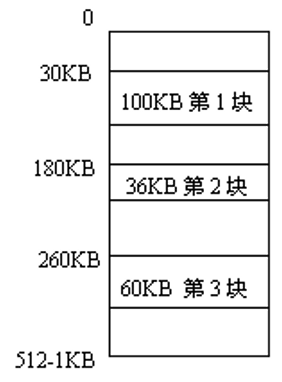
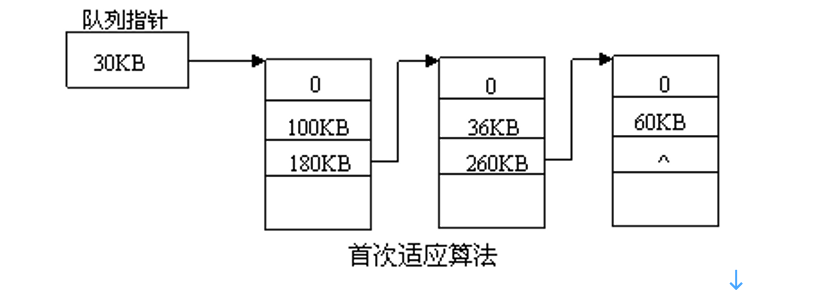
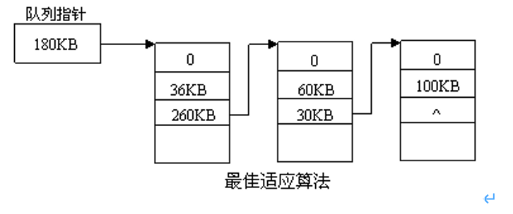

## 选择题

1. 可重定位内存的分区分配目的是为（A）。
    - A. 解决碎片问题              
    - B. 便于多作业共享内存
    - C. 便于用户干预              
    - D. 回收空白区方便
    > 【解析】为了解决碎片问题，采用紧凑技术移动内存中的所有作业，使它们相邻，用动态重定位方法解决移动后地址的重定位，因此动态重定位是为了解决碎片问题。

1. 在页式存储管理系统中，采用某些页面置换算法，会出现Belady异常现象，即进程的缺页次数会随着分配给该进程的页框个数的增加而增加。下列算法中，可能出现Belady异常现象的是（A）。   
    - A. FIFO算法
    - B. LRU算法
    - C. OPT算法     
    - D. CLOCK算法
    >【解析】Belady现象是系统为进程分配的页数增多（未分配进程所需的全部页），但缺页率反而提高的异常现象。只有FIFO算法才会出现Belady现象。FIFO算法将最早调入的页调出，而调出的页在不久可能会被重新使用出现反复调入调出，缺页率反而上升。

1. 请求分段系统在分段系统的基础上，增加了（A）及分段置换软件功能。
    - A. 请求调段       
    - B. 段表       
    - C. 缺段中断      
    - D. 地址变换
    > 【解析】请求分段存储管理系统是在基本分段存储系统的基础上，增加了请求调段及置换功能。

1. 下列措施中，能加快虚实地址转换的是（C）。
    > 1增大快表(TLB)    2让页表常驻内存    3增大交换区   
    - A. 仅1         
    - B. 仅2        
    - C. 仅1，2       
    - D. 仅2，3 
    > 【解析】增大快表能增加快表的命中率，即减少了访问内存的次数；让页表常驻内存能够使CPU不用访问内存找页表，也加快了虚实地址转换。而增大交换区只是对内存的一种扩充作用，对虚实地址转换并无影响。

1. 在分页虚拟存储管理中，“二次机会”调度策略和“时钟”调度策略在决定淘汰哪一页时，都用到了（C）。
    - A. 虚实地址变换机构     
    - B. 快表     
    - C. 引用位     
    - D. 修改位
    >【解析】“二次机会”调度策略和“时钟”调度策略都是LRU算法的近似算法，两者都考虑了最近一段时间内页面的引用情况，即都用到了“引用位”。

1. 在分页管理系统中，为实现地址转换设置了寄存器，其中存放的是（页表）在内存中的起始地址。
    >【解析】在系统中设置地址变换机构，主要是为了将程序中的逻辑地址转换为内存中的物理地址。在分页管理系统中，页表大多驻留在内存中，为实现地址转换，设置了控制寄存器，其中存放的是页表在内存中的起始地址和页表长度。

1. 分页存储管理系统具有快表，内存访问时间为2μs，检索快表时间为0.5μs。若快表的命中率为80%，且忽略快表更新时间，则有效访问时间是（2.9μs）μs。
    >【解析】在引入快表的分页存储管理系统中，有效访问时间的计算公式为：
        EAT=a×λ+(t+λ) ×(1-a)+t=2t+λ-t×a
        其中，t为内存访问时间，t=2μs；λ为检索快表的时间，λ=0.5μs；a为快表的命中率，a=80%。代入数据，得有效访问时间EAT=2.9μs。

## 填空题

1. 在具有两级页表的分页存储管理系统中，CPU每次要存取一个数据时，必须访问（3）次内存。
【解析】两级页表中，CPU存取一个数据要访问3次内存。第1次访问一级页表，第2次获得二级页表，第3次存取数据。

## 计算题

1. 设某系统主存容量为 512KB  ，采用动态分区存储管理技术。某时刻 t 主存中有三个空闲区，它们的首地址和大小分别是：空闲区 1 （ 30KB  ， 100KB  ）、空闲区 2 （ 180KB  ， 36KB  ）、空闲区 3（ 260KB  ， 60KB  ）。系统现有如下作业序列A  ：作业 1 （请求 38KB  ）、作业 2 （请求 20KB  ）、作业 3 （请求 30KB  ）、作业 4 （请求 80KB  ）。 
    1. 画出该系统在时刻 t 的内存分布图；
    2. 用首次适应算法和最佳适应算法画出时刻 t 的空闲区队列结构； 
    3. 用上述两种算法对作业序列A  进行分配，哪种算法对该作业序列是合适的？要求给出必要的分配过程，并用图画出在分配过程中空闲区队列结构的变化。 

    [解析]
    1. 
    2. 
        
    3. 
2. 
